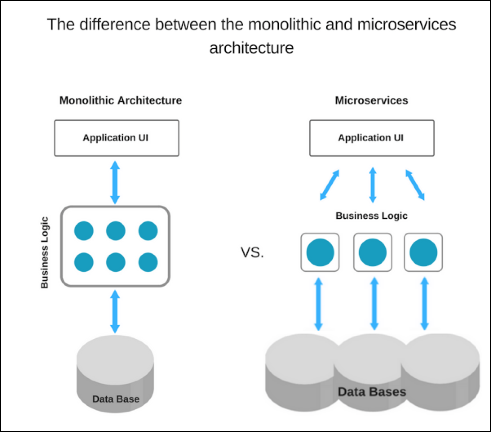

## Monolithic vs MSA

### Monolithic
**Monolithic**은 예전부터 사용하던 방식으로, **하나의 서비스를 하나의 어플리케이션**으로 만드는 것을 의미 합니다.

#### 장점
- **작은 규모의 프로젝트 환경**에서 개발이 편리 합니다.
- **통합 테스트**가 **MSA**에 비해 편리합니다.
- 배포가 **간편** 합니다.

#### 단점
- 서비스가 커질수록, **코드의 수정 및 추가가 힘듭니다.**
- **효율적인 자원 관리**가 어렵습니다.
- 서비스 내 특정 부분이 잘못되면 **서비스 전체가 마비 됩니다.**
- 여러 개의 노드를 만들어 성능을 올리는 **Scale Out** 이 불가능 합니다.

### MSA (Micro Service Architecture)

그와 반대로 **MSA (Micro Service Architecture)**은 **하나의 서비스를 여러 개의 작은 어플리케이션**으로 만드는 것을 의미합니다. 대부분의 경우 **Kubernetes** 같은 **Container Orchestration** 툴을 이용 하여 운영합니다.

#### 장점
- **Scale Out**이 가능 합니다.
- **개별 서비스 단위의 배포**가 가능 합니다.
- 코드 **수정 및 배포**가 쉬워, 요구사항의 **잦은 변경에 대처**가 용이 합니다.
- 작은 기능에 대해 독립적으로 서비스를 운영 할 수 있어, **신규 기술을 도입 하는데 용이** 합니다.

#### 단점
- 로그 추적 등 **Trouble Shooting**이 쉽지 않습니다.
- **통합 환경 테스트**가 어렵습니다.
- 다른 컨테이너 간 통신을 하는 API일 경우 **트렌젝션 처리**가 어렵습니다.
- 서버가 분리 됨에 따라, **배포가 어려워** 집니다.

    

