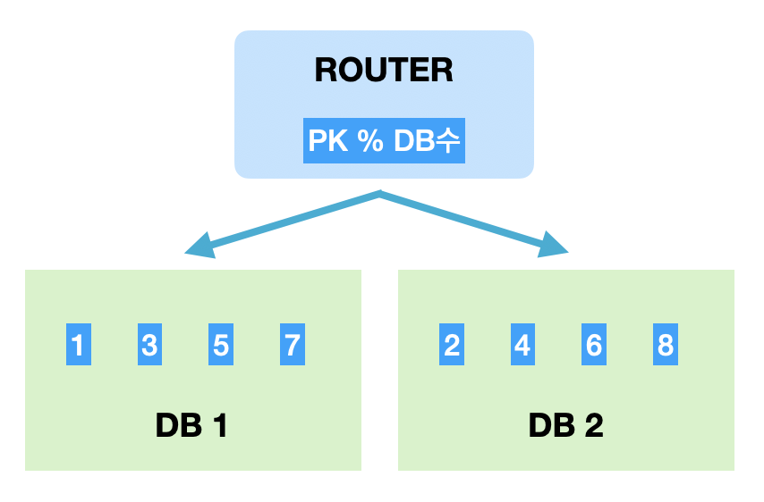

## NoSQL은 왜 쓰는 건가요?
굳이 **MySQL** 같은 **RDBMS**가 있는 상황에서, **NoSQL**을 사용 하는 이유가 무엇일까요? 그 이유는 여러 가지를 꼽을 수 있습니다.

### Scale Out 가능
**RDBMS**는 **관계형 데이터**이기 때문에, **Scale Out**이 불가능 합니다. 성능을 올리기 위해선, 무조건 해당 컴퓨터의 성능을 높이는 **Scale Up**을 실시해야 합니다. 하지만, **NoSQL**은, 테이블 간의 관계를 정의 하지 않기 때문에, 여러 노드에 데이터를 분산하여 저장하는 **Sharding**이 가능하여 **Scale Out**이 가능합니다.

### Sharding
**Sharding**은 대량의 데이터베이스를 분할 하는 기술입니다. 하나의 DB에 데이터가 늘어나면 **용량 이슈**도 생기고, 느려지는 쿼리는 서비스 성능에 영향을 미칩니다. 그렇기 때문에 **DB 트래픽을 여러 개의 노드로 분산**하는 목적으로 샤딩을 사용 합니다.

샤딩을 하는 방법은 대표적으로 **PK값을 모듈러 연산**한 결과로 저장하는 **Modular Sharding**과 **PK의 범위를 기준으로 연산**한 **Range Sharding**이 있습니다.

혹은, 데이터의 지역성을 유지하기 위해서, 같이 조회 될 만한 데이터들 끼리 묶일 수 있도록 샤딩 정책을 세워도 됩니다.

    
    
출처 : https://techblog.woowahan.com/2687/

### NoSQL을 쓰면 안되는 경우?
엔티티간 관계가 있고, 해당 데이터의 **무결성**이 중요한 경우에는 **RDBMS**를 사용 합니다. 이를 보완하기 위해, **무결성**이 중요한 로직에는 **RDBMS**를, **속도**가 중요한 로직은 **NoSQL**을, 병행해서 사용하는 경우도 있습니다.