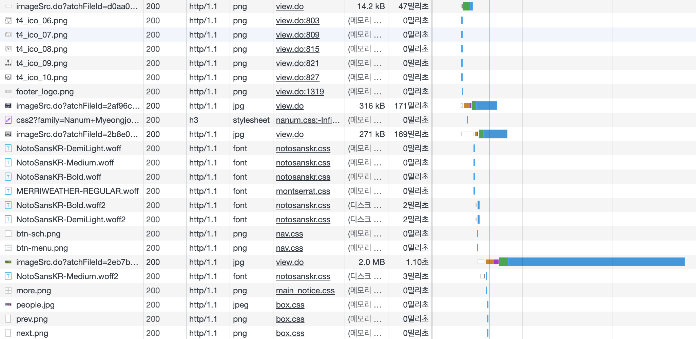
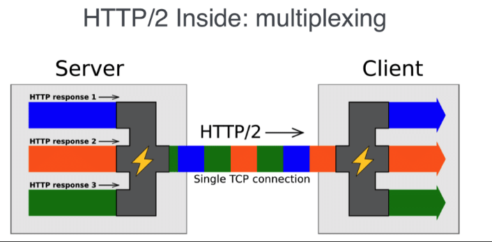
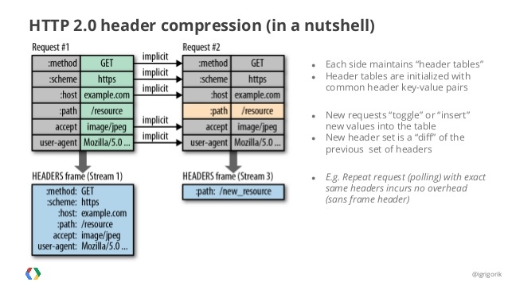

## HTTP 1.1
**HTTP 1.1**은 기본적으로 하나의 **Connection**당 하나의 **요청**을 처리 하도록 설계 되었습니다.

그렇기 때문에 **동시 전송이 불가능**하고 요청과 응답이 순차적으로 이뤄집니다. 그래서 다수의 리소스 (Image, CSS, Javascript 등)를 처리 하기 위해서는, 그 리소스 갯수 만큼 계속 기다려야 하는 것이지요.

### 단점 1. HOL(Head Of Line) Blocking
**HOL(Head Of Line) Blocking**은 네트워크에서 같은 큐에 있는 패킷이 첫 번째 패킷에 의해 지연 될 때 발생하는 성능 저하 현상을 말합니다.

만약 TCP 단위에서 패킷이 소실 되더라도, 해당 패킷이 재전송 되어 다시 받아질 때 까지, 나머지 패킷들을 계속 이를 기다려야 하는 것이지요.

또한, 이는 HTTP 단위에서도 문제를 발생 시킵니다. **HTTP 1.1** 기반으로 통신하는 `https://ce.khu.ac.kr/`에 접속 하면, 다음과 같은 일이 일어 납니다. 한 가지 요청이 끝날 때 까지, 다른 자원들은 로딩이 다 될 때 까지 기다려야 해요.

    

### 단점 2. RTT(Round Trip Time)
요청당 한 가지만 처리 하다 보니, 매번 요청 별로 **Connection**을 만들어 **TCP** 상에서 동작하는 **HTTP**의 특성상 **3-way Handshake**가 반복적으로 일어 납니다. 그렇게 되면 성능 저하가 발생 하겠지요.

### 단점 3. 무거운 Header
매 요청마다 중복된 헤더 값을 전송하게 되고, 쿠키 또한 계속해서 헤더에 포함되어 전송 하게 됩니다. 그러다 보니 **Overhead**가 커지게 되는 것이지요.

## HTTP 2.0
그래서 **HTTP 2.0**이 등장 하게 되었습니다. 프로토콜의 성능에 초점을 맞춰 수정한 버전 으로, 실사용 유저가 느끼는 Latency, 네트워크, 서버 리소스 사용량 등을 중점으로 수정 하였습니다.

### Multiplexed Streams
**HTTP 2.0**은 **Multiplexed Streams**를 이용, **Connection 한 개**로 **동시에 여러 개의 메시지**를 주고 받을 수 있습니다.

    

### Stream Prioritization
만약 **CSS**와 **Image**가 두 개 존재하는 상황에서, **이미지 파일**보다 **CSS 파일**의 수신이 늦어진다면 어떤 문제가 발생 할까요? 레이아웃이 깨져 보여서 별로 좋아 보이지는 않을 것 입니다. 그럴 때는 리소스에 **우선 순위**를 붙여, 더 높은 우선순위를 가진 리소스를 먼저 가져 오는 것이 좋을 것 입니다.

### Server Push
서버는 클라이언트가 요청하지 않아도, 사전에 리소스를 클라이언트에 푸쉬하여, 리소스를 클라이언트에서 다운로드 가능 캐 할 수 있습니다. 이렇게 하면 클라이언트의 요청을 최소화 할 수 있습니다.

### Header Compression
헤더 정보를 압축하기 위해 `Header Table`과 `Huffman Encoding`을 사용하여 처리 할 수 있습니다. 헤더 중복이 있는 경우, 중복을 검출하고, 해당 테이블의 `index`와 중복 되지 않은 `Header` 정보를 `Huffman Encoding` 방식으로 인코딩 할 수 있습니다.

    

