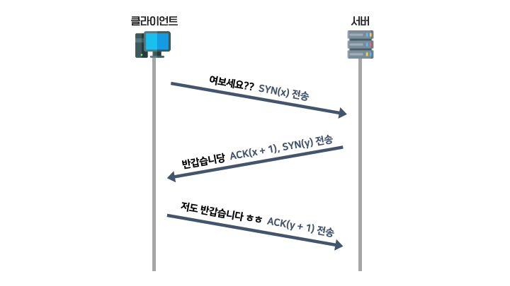
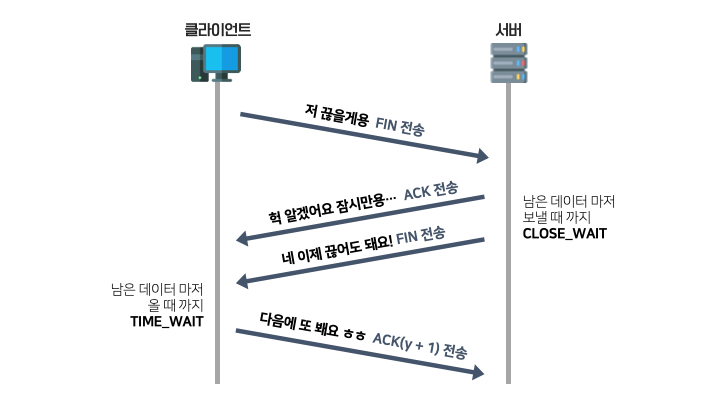
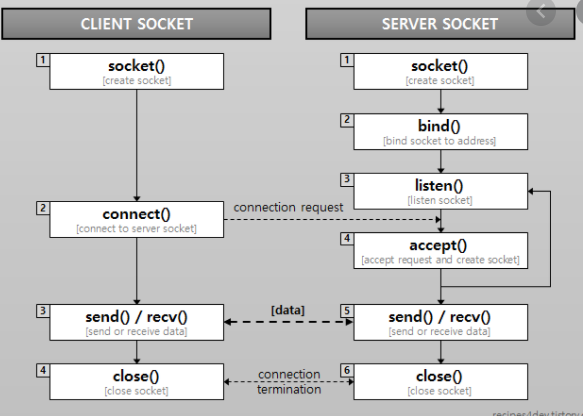

## 우리가 웹 사이트를 접속 할 때 일어나는 일
우리가 **Google Chrome** 같은 웹 브라우저를 통해서 웹 사이트를 접속 한다고 가정 합니다.

예를 들어 `ce.khu.ac.kr`에 접속 한다고 가정 하겠습니다.

- 제일 먼저 **OSI 7 계층**에 대해서 알아 보겠습니다.
    - **OSI 7 계층**은 네트워크를 구성하는 표준 계층 중 하나 입니다.
    - 이렇게 7계층으로 나눈 이유는, 이렇게 분리 함으로써 **독립적으로 문제를 해결 할 수 있기 때문입니다.**   

    1. 물리(Physical) 계층
        - 데이터를 전기적인 신호로 변환하여, **물리적으로 주고 받는 계층**입니다.
        - 케이블, 허브 등이 해당 됩니다.
    2. 데이터 링크(Data Link) 계층
        - 물리 계층으로 송수신 하는 정보를 관리하여, **안전하게 전달**되도록 하는 역할을 합니다.
        - 각 기기마다 **고유한 Mac 주소를 이용**하여 통신 합니다.
        - 전송 단위는 **Frame**이며, 사용 장비로는 브릿지, 스위치 등이 해당 됩니다.
    3. 네트워크(Network) 계층
        - 데이터를 목적지까지 가장 안전하고 빠르게 전달하는 기능을 담당 합니다. 우리가 흔히 아는 IP주소를 제공하며, 해당 IP 주소를 이용하여, 데이터를 전송 합니다.
        - 전송 단위는 **Packet**이며, 장비로는 **라우터, L3** 스위치가 있습니다.
    4. 전송(Transport) 계층
        - 우리가 흔히 아는 **TCP, UDP**가 여기에 속합니다.
        - **Endpoint** 사이의 신뢰성 있는 정확한 데이터 전송을 담당합니다. 오류 검출 및 복구, 흐름제어와 중복검사 등을 수행 합니다.
        - **Port** 번호를 사용 합니다.
        - 전송 단위는 **Segment** 입니다.
    5. 세션(Session) 계층
        - 데이터가 통신하기 위한 논리적 연결을 담당합니다. TCP/IP 세션을 만들고 없애는 책임을 가지고 있습니다.
        - 대표적으로 **RPC, Socket** 등이 있습니다.
    6. 표현(Presentation) 계층
        - 데이터 표현에 대한 독립성을 제공하고 암호화하는 역할을 담당합니다.
        - 파일 인코딩, 명령어 포장, 압축, 암호화를 담당 합니다.
    7. 응용(Application) 계층
        - 응용 프로세스와 직접 관계하여, 일반적인 응용 서비스를 수행 합니다.
        - 대표적으로 우리가 알고 있는 **HTTP, FTP** 등의 프로토콜이 해당 됩니다.

- 웹 브라우저는 URL에 적힌 값에 따라, 적절히 **HTTP Request Message**를 만듭니다.
    - 일단 유저가 어디서 접속하는지, 주로 쓰는 언어가 무엇인지, 어떤 기계를 사용하고 있는지에 따라서 **HTTP Header**를 적절하게 설정 합니다.
        - 다른 **메서드**의 사용 없이, 웹 브라우저를 통해 **조회** 하는 것이기 때문에 method 에는 **GET**이 사용 됩니다.
        - accept-language는 사용 하는 언어, user-agent에는 사용 하는 기기, accept에는 받을 데이터 타입, accept-encoding에는 사용 가능한 인코딩, cookie에는 사용자가 저장하고 있는 쿠키가 될 것입니다.
    - 일단 `ce.khu.ac.kr` 이라는 **DNS**를 통해서 접근 하였을 테니, 도메인에 매칭되는 IP를 찾기 위한 **DNS Lookup**이 시작 될 것 입니다. 첫 번째는 **브라우저에 저장 된 값**, 두 번째는 **각 컴퓨터의 hosts 파일** (운영체제에 따라 다름, 맥은 /etc/hosts), 세 번째는 **DNS Server**를 뒤질 것 입니다.
        - **DNS Server**를 뒤질 때는 다음과 같은 과정으로 **Recursive Query**를 이용하여 파일을 뒤집니다.

        

            
        

    - IP를 찾았다면 이제 요청을 하자고 할 시간 입니다. **TCP/IP**를 이용한, **Socket** (5계층) 기반의 **HTTP/1.1** (7계층) 프로토콜을 이용하여 통신을 시작 합니다.
        - **TCP/IP**의 연결은 다음과 같은 과정을 가집니다. 연결을 위해 **3 way handshake**를, 연결 해제를 위해 **4 way handshake**를 실시 합니다.
        

            
        

        

            
        

        - **Socket** 단위에서는 통신을 하기 위해서 다음과 같은 과정이 발생 합니다. **Socket**을 이용 하지만, 양방향 통신을 하지는 않습니다.
        

            
        

        - **HTTP/1.1** 에서는 아까 만든 **HTTP Request Header**를 전송 합니다. **OSI 7 계층을 통해서** 통신을 시작 합니다.  
- 이제 구글 서버에서는 **HTTP Request Header**에 있는 값을 받아, 서버 어플리케이션이 만들어 놓은 로직에 따라서 적당한 응답을 만들어 냅니다.
    - 구글 로그인이 되어 있다면, 유저가 누구냐에 따라서 **Dynamic**한 응답을 만들어 냅니다.
    - 공통적으로 필요한 파일 같은 경우 (로고, 레이아웃 css, js)등은 **Static**하게 응답을 보냅니다.
    - 어떤 데이터를 보냈는지 알려주기 위해, **Content-type, Content-Length, Date**를 **HTTP Response Header**에 말아 보냅니다.
    - 캐시, 쿠키를 관리 하기 위해, **cache-control, set-cookie** 등의 헤더를 보냅니다.  

- 이 응답을 유저가 받아, 웹 브라우저는 적절하게 랜더링 합니다.
    - 여기서 HTTP/1.1 이라서 발생 하는 문제가 있습니다. 그 다음 내용은, **HTTP/1.1과 HTTP/2.0의 차이점**을 참고하세요.
    