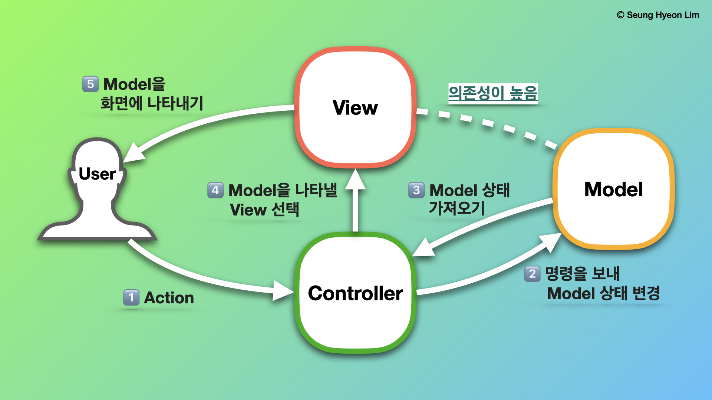
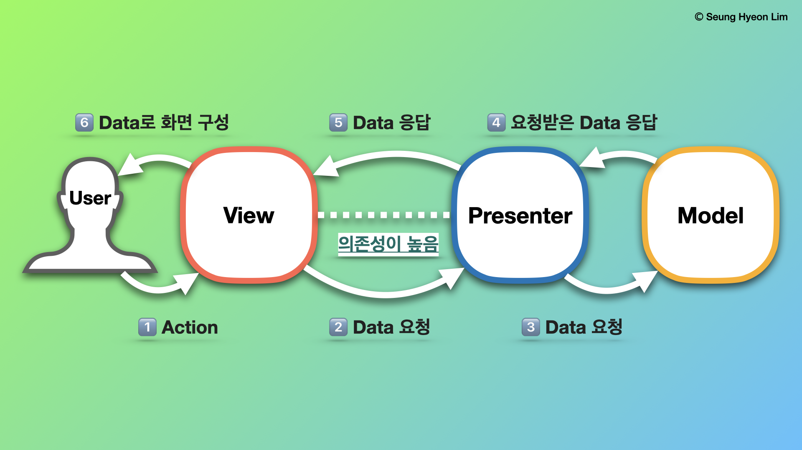
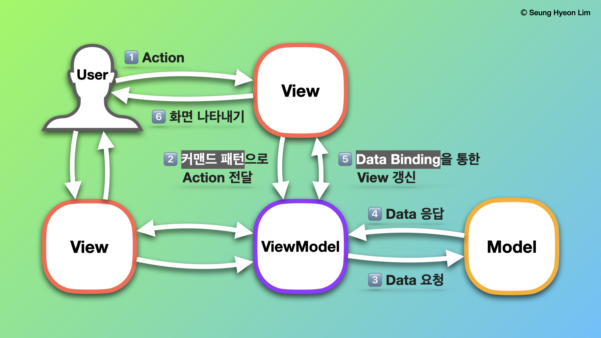
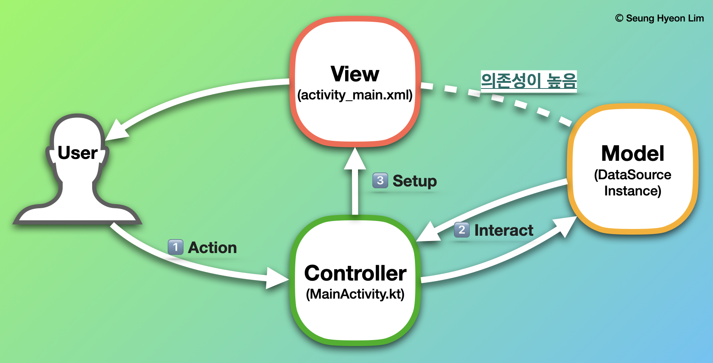
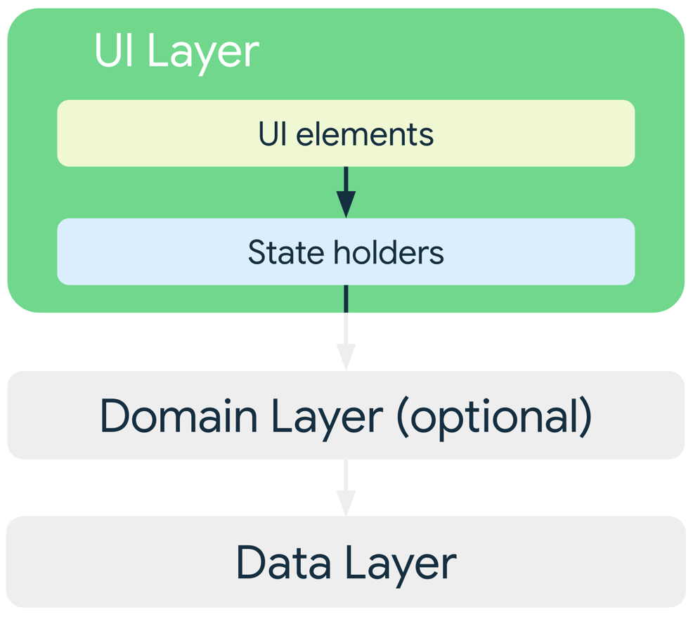

# Android에서 MVVM 패턴이 중요한 이유
___

## → Architecture Pattern이란
>
> An **architectural pattern** is a general, reusable solution 
> to a commonly occurring problem in software architecture   
> within a given context.
>
위키피디아에서는 아키텍처 패턴을 "주어진 컨텍스트 내에서, 소프트웨어 아키텍처에서 주로 발생하는 문제에 대한 일반적이고, 재사용 가능한 솔루션"이라고 정의합니다. 
여기서 **소프트웨어 아키텍처에서 주로 발생하는 문제**라 함은, 서비스를 구현하고 유지-보수의 단계에 이르기까지 개발자가 직면하는 모든 상황을 일컫는 말입니다. 
필자는 그러한 케이스들을 '특정한 형식을 취하여' 쉽게 풀어나갈 수 있도록 하는 **약속의 소프트웨어적 구현 방식**을 '아키텍처 패턴'이라고 생각합니다.
___

## 🗂️ Architecture Pattern의 종류
이 단락에서는 순서대로 **MVC, MVP, MVVM** 패턴으로 구현된 애플리케이션의 기본적인 Data Flow에 대해 다룹니다.

### 0️⃣ 기본 용어 정리 (Frontend 기준)
| 용어 | 의미 |
|:---|:---|
|**View**|사용자가 **화면에서 보는 것들**에 대한 구조, 배치, 그리고 외관.|
|**Model**|**Data와 Data를 가져오는 Logic**을 통틀어 이르는 말.|
|**Controller**|Model에 명령을 보내 그 상태를 변경 & View에 명령을 보내 Model의 표시 방법 변경.|
|**Presenter**|View가 요청하는 Data를 Model로부터 가져와, 이를 가공하여 View에 전달.|
|**ViewModel**|View의 **추상화된 형태**(Abstraction). View에 보여지는 데이터와 명령들을 가지고 있음. |

___
### 1️⃣ Model-View-Controller

    

<u>**특징: Model과 View 사이의 의존성이 강함**</u>

1. Controller로 사용자의 입력이 들어옵니다.
2. Controller는 Model의 데이터를 업데이트하거나, 사용자가 요청한 데이터를 불러오고,
3. Model은 해당 데이터를 보여줄 View를 선택해서 화면에 보여주게 됩니다.

___
### 2️⃣ Model-View-Presenter

    

<u>**특징: Presenter와 View 사이의 의존성이 강함 (1:1로 대응.)**</u>

1. View를 통해 사용자의 특정한 입력이 들어옵니다.
2. View는 Presenter에 작업(데이터 업데이트 및 필요한 데이터 가져오기) 요청을 합니다.
3. Presenter가 필요한 데이터를 Model에 요청합니다.
4. Model은 Presenter가 요청한 데이터를 응답으로 내보냅니다. 
5. Presenter는 View에 데이터를 내보냅니다. 
6. View는 Presenter로부터 받은 데이터로 각각의 View Component들이 구성됩니다.

___
### 3️⃣ Model-View-ViewModel

    

<u>**특징: View와 ViewModel이 n:1로 대응 → ViewModel Class의 재활용성 ⬆️**</u>

1. View를 통해 사용자의 입력이 들어오면, Command Pattern으로 ViewModel에 특정 Action을 전달합니다.
2. ViewModel은 필요한 데이터를 Model에 요청합니다.
3. Model은 ViewModel에 요청한 데이터를 넘겨줍니다.
4. ViewModel은 응답 받은 데이터를 가공해서 **View의 상태(State)를 Hold**합니다.
5. View는 ViewModel과의 **Data Binding**을 통해 자동으로 갱신됩니다. 
   (이를 View가 ViewModel이 가진 Data를 **Observe**, 즉 관찰한다고 표현합니다.)

___
## 🏁 MVVM Pattern을 권장하는 이유

### 1️⃣ Seperation of Concerns: 관심사 분리

    

- Android에서는(다른 Frontend 개발과 비슷하게) 애플리케이션의 시스템을 크게 세 가지 계층(layer)으로 구분하여 설계합니다. 
**UI Layer**, **Domain Layer**(선택사항), **Data Layer**가 바로 그것입니다. 
- 어떤 아키텍처 패턴을 사용하든지 간에, 세 Layer에 각각의 역할을 적절하게 부여하여, 
다른 모든 SW 개발과 마찬가지로 [관심사 분리 원칙](https://en.wikipedia.org/wiki/Separation_of_concerns)을 충실히 이행해야 합니다.
- 주로, Android Native 개발에서 위 원칙을 위반하는 경우는 **`Activity`나 `Fragment`에 모든 코드를 작성하는 실수**로 인해 발생합니다.
- `Activity`나 `Fragment`와 같은 UI-Based Class는 User Interface, 
   그리고 User와의 상호작용(ex. 버튼 클릭 등)을 처리하는 로직만을 포함해야 합니다.
- 이러한 Class를 최대한 가볍게 유지하는 것이 Component Lifecycle와 관련된 문제를 피하고, 
  테스트 유용성 및 유지/보수의 용이성을 높이는 데 도움이 됩니다.

### ☑️ <u>Why not MVC : 비대해지는 UI Controller</u>

    

- 안드로이드에 MVC 아키텍처 패턴을 적용하는 것이 어려운 이유는, 위에서 언급한 **관심사 분리 원칙을 정면으로 위배**하는 행위이기 때문입니다.
- Android Native에서 Controller에 해당하는 역할을 수행하는 Class가 바로 `Activity`와 `Fragment`인데, 
  이 둘은 UI-based Class로서의 기능도 해야 합니다. `.xml` 파일은 그저 UI Component를 보여주는 역할만 수행할 뿐 입니다.
- MVC로 프로젝트를 구성하게 되면, `Activity`와 `Fragment`가 User와의 상호작용은 물론, 
  Model과의 상호작용(데이터 요청 및 수정)도 동시에 담당하게 되므로, 관심사 분리 원칙에서 언급한 **실수**가 일어나게 됩니다.
- 여러 기능을 구현할수록, Controller에 해당하는 코드의 양이 비대해지며, 이는 유지/보수를 어렵게 합니다.

___
### 2️⃣ Unidirectional Data Flow: 단방향 데이터 흐름

    

- Android Native에서, 단방향 데이터 흐름 패턴(이하 **UDF 패턴**)을 충족한다는 것은, 
  1️⃣ <u>**상태(State or Data)는 Data Layer에서 UI Layer로 흐른다는 것**</u>,
  2️⃣ <u>**데이터 흐름을 수정하게 되는 이벤트(User Action)는 UI Layer에서 Data Layer 방향으로 흐른다는 것을**</u> 의미합니다.
- 이는 데이터 관리의 안정성을 강화하며, 오류가 발생할 가능성을 크게 낮춥니다.
- Android에서는 이러한 흐름을 다음과 같은 구성으로 구현합니다. (Event 흐름 기준)
  - UI Layer : **UI Elements (View or Jetpack Compose)** -> **State Holder(ViewModel Class)** ->
  - Data Layer : -> **Repositories** ->**Data Source(A Network Source, a File, or a local DB)**
- 위에서 State Holder의 역할은 MVP 패턴에서는 <u>Presenter</u>가, MVVM 패턴에서는 <u>ViewModel</u>이 담당합니다.

### ☑️ <u>State Holder : ViewModel vs. Presenter</u>

##### 공통점
- Android Native에서 **MVP와 MVVM 패턴의 공통점은 `Activity`와 `Fragment`가 User와의 상호작용만을 담당한다는 것**입니다.
- 두 아키텍처 패턴은 관심사 분리 원칙에 온전히 부합하며, 단방향 데이터 흐름 패턴을 가집니다.
- 위에서 언급하지 않은 내용이지만, MVC에서는 View가 사실상 Controller와 결합된 형태라, 유닛 테스트 구성이 번거롭습니다.
  하지만 MVP의 경우, State Holder가 특정 View와 결합되지 않기 때문에, 가상 뷰를 구현하는 방식으로 유닛 테스트을 진행할 수 있습니다.

##### 차이점
- 그러나 **MVVM의 ViewModel은 MVP의 Presenter와 달리, View에 대한 의존성을 전혀 가지고 있지 않습니다.**
- **Data Binding과 (ViewModel에 존재하는) Observable(관찰 가능한) 변수**는 보다 애플리케이션의 반응 속도를 높여줍니다.
- MVP에서처럼 가상 뷰를 만드는 방식이 아니라, 그저 Observable 변수가 제대로 설정되었는지 확인하는 것 만으로 유닛 테스트가 가능해집니다.
- Android의 AAC(Android Architecture Component, Jetpack에 포함된 라이브러리) ViewModel은 
  여러 Fragment가 **공통된 데이터를 각자가 담당한 View에 Binding할 수 있도록 구현**되어 있으므로 (데이터 공유 역할),
  Presenter에 비해 재활용성이 높다는 점도 큰 장점입니다. 

  

___
## 🧭 References
- [영문판 위키피디아 - Architectural Pattern](https://en.wikipedia.org/wiki/Architectural_pattern)
- [Guide to App Architecture - Android Developer (4,6번 이미지 출처)](https://developer.android.com/jetpack/guide?hl=en)
- [안드로이드의 MVC, MVP, MVVM 종합 안내서](https://academy.realm.io/kr/posts/eric-maxwell-mvc-mvp-and-mvvm-on-android/)