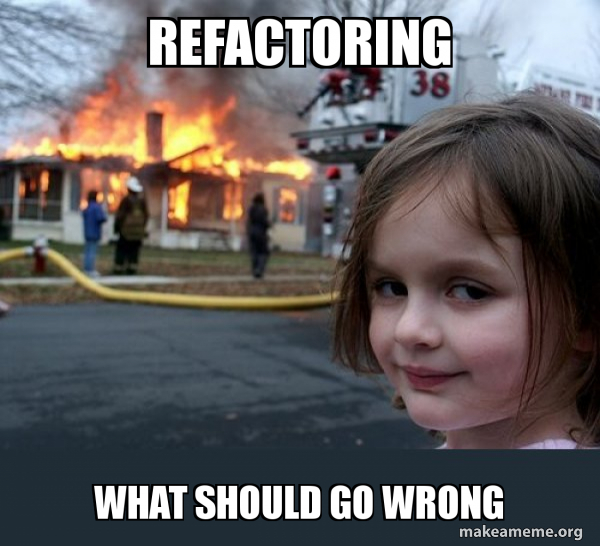
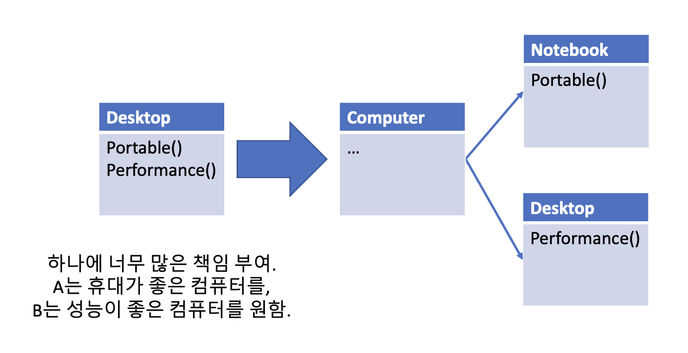
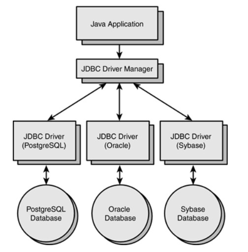
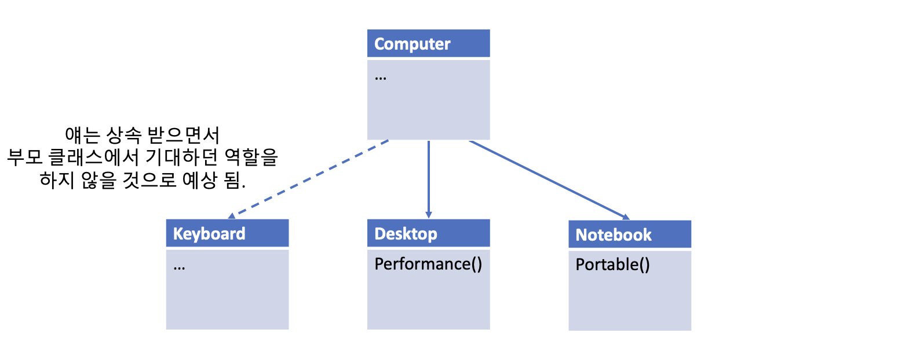
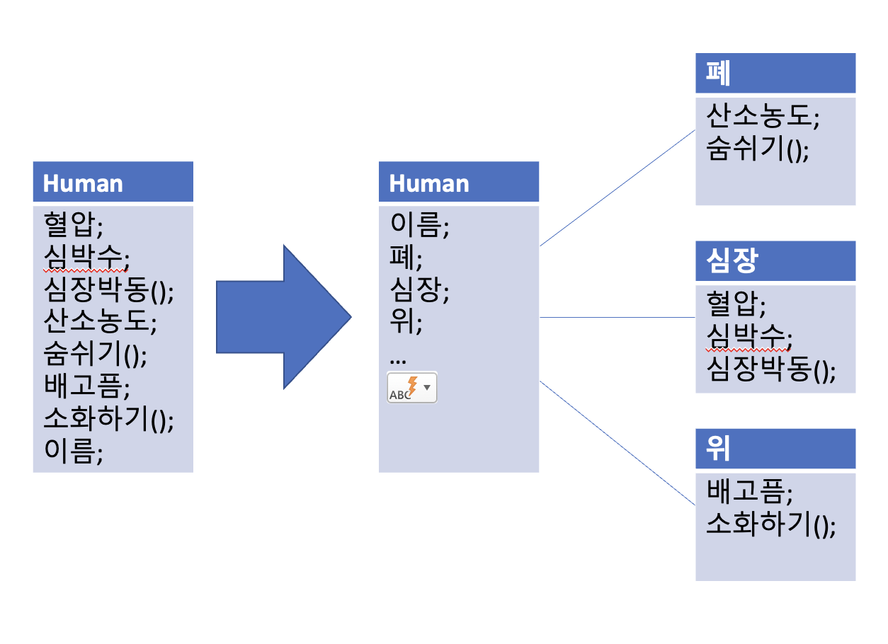
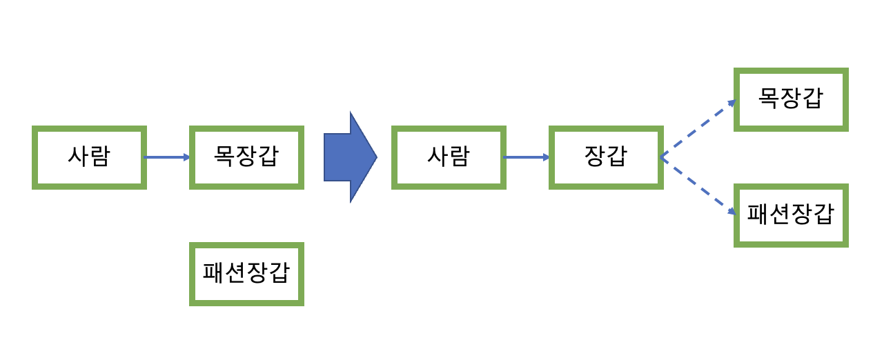

### SOLID 원칙
**SOLID 원칙**은 **객체지향 설계**에서 지켜줘야 하는 5가지 원칙을 의미 합니다.

우리는 협업을 하면서, 많은 어려움을 봉착 합니다. 분명 기능 1개만 수정 한다고 특정 컴포넌트의 코드를 몇 가지 수정했는데, **이와 연관된 여러 개의 컴포넌트에서 오류**를 뱉어 버리는 경우는 개발을 해보신 분들이라면 많이 경험해 봤을 것이라고 생각해요.

	
	

		테스트 서버에 불이 났습니다.
	

### SRP(Single Responsibility Principle), 단일 책임 원칙
이는 간단한 원칙입니다. **한 가지 객체는, 한 가지 기능만 해야 한다**는 것입니다. 원래 이 원칙을 제안한 로버트의 말은 다음과 같습니다. **"어떤 클래스를 변경해야 하는 이유는, 오직 하나뿐이어야 합니다."**

객체지향적으로 클래스를 설계시에는 **결합도를 낮게, 응집도를 높게** 설계 하여야 합니다.

- **결합도**: 프로그램의 **서로 다른 모듈들**이 **서로 얼마나 의존적**인지를 의미 합니다.
- **응집도**: **같은 모듈 내부의 요소**들이 **서로 얼마나 관련되어 있는지**를 의미 합니다.

우리는 **SRP** 원칙을 지켜 이를 해결 하고자 합니다.

우리가 프로그램을 짤때, **한 가지 역할**을 하는 코드를 수정을 해야 하는 경우가 있습니다. 이를 위해서 코드 내의 **클래스**를 변경 하게 되는데, 여기서 **해당 클래스가 여러 개의 역할에 걸쳐 있는 경우** 클래스 수정 시, 다른 역할에서는 제대로 동작 하지 않을 수 있습니다.

대충 역할이 어떤 느낌인지는 알겠는데, 정확히 어떤 의미를 갖는지는 아직 아리까리 합니다. 한 객체 마다 여러 가지 메서드가 있고, 다중 상속을 할 수도 있고, 클라이언트가 여럿 일 수도 있기 때문입니다. 그래서 이 의문을 해결하기 위해, 우리는 **역할**을 **액터**라는 개념으로 치환 하려고 합니다. 여기서 **액터**는, **시스템 내에서 동일한 방식으로 변경되기를 원하는 사용자 집단**을 의미 합니다.

만약 **TCP**를 처리 하는 객체가 있다고 가정 하겠습니다. 요구 사항이 **"TCP 통신을 하기 위한 액터"** 라는 것으로 이해 하고, 여러 개의 API를 TCP 객체로 만들었다고 가정 하겠습니다. 그러면 우리는 수정 하려고 하는 객체가 **TCP 통신을 하기 위한 엑터**라고 알고 있기 때문에, 원래 하던 역할을 벗어나지 않는 선에서 변경이 가능 한 것입니다. 누가 이 객체를 **다른 용도**로 사용 하지 않는다면요. 해당 엑터가 역할을 수행 할 수 없게 되지 않는 이상, 또한, 이를 사용하는 다른 코드가 모두 해당 변경에 대해서 수용 할 수 있다면, 그러면 문제가 되지 않는 것 입니다.

`Desktop` 이라는 클래스가 있고, `A`와 `B`라는 클래스가 있다고 가정 하겠습니다. 만약 `A`와 `B`가 멤버변수로 `Desktop`을 참조 하는데, `A`의 용도에 맞게 `Desktop`의 성능을 줄이고 휴대가 가능하게 끔 하고 싶습니다. 그래서 `A`가 `Desktop`의 성능을 줄이고, 휴대가 가능하게 기능을 수정 했습니다. 하지만, `B`가 애초에 성능이 좋은 컴퓨터를 요구 한 것이라면요? 사실 이건 `A`가 `Desktop`을 참조 할 것이 아닌, 새롭게 `Notebook`이라는 친구를 만들어서 `A`에 맞게 만드는 게 맞습니다. **`Desktop`의 역할은 이를 사용 하는 같은 엑터들 끼리 약속이 된 사항이거든요.**

	
	

		차라리 나누어 관리 할 것.
	

### OCP(Open-Closed Principle), 개방 폐쇄 원칙
**개방 폐쇄 원칙**은 **"확장에는 열려 있어야 하고, 변경에는 닫혀 있어야 한다."**를 의미 합니다. 더 정확한 표현으로는 **"기능의 변경 및 확장은 필요 하지만, 그 기능을 사용 하는 코드를 수정 하지 않는 것 입니다."**

예를 들어 보겠습니다. 우리가 어떤 **API**를 사용 하고 있었습니다. 그런데 어느날 **API**가 업데이트가 됐고, 기존 코드가 사용 불가능 하게 되었습니다. 이를 다른 방법으로 사용해야 하기 때문이에요. 이는 **OCP**를 위반 한 대표적인 사례 입니다. 하나의 변화가 연쇄적으로 변화를 일으키기 때문이에요.

우리는 이를 해결하는 방법으로, **추상화**를 선택 할 수 있습니다. 내가 아무리 객체 내의 코드를 수정 하고, 확장 한다고 해도, **추상화**된 메서드를 목적에 맞게 구현 하는 것이 강제 되고, 또 코드에선 **추상화**된 부분에 대해서만 사용 한다면, 하나의 변화로 인해, 연쇄적인 변화가 이루어지는 것을 방지 할 수 있습니다. 그리고 외부에서는 코드가 바뀐 것을 모르게 작성 해야 합니다. 그것도 중요한 포인트에요. 다른 사람들이 이 코드의 변경 사항을 모른다면, 

예를 들어 아래 처럼, 사용 하는 데이터베이스가 다르더라도, **Driver Manager**라는 부모 클래스로 묶어서 관리 할 수 있는 것이죠. **Driver Manager**에 대한 코드만 사용 한다면, 우리가 데이터베이스가 바뀌더라도, 문제 없이 사용 할 수 있을 것입니다.

	
	

		JDBC Driver Manager
	

### LSP(Liskov Substitution Principle), 리스코프 치환 법칙
이는 생각보다 간단한 원칙 입니다. **"상위 타입의 객체를 하위 타입의 객체로 치환해도 상위 타입을 사용하는 프로그램은 정상적으로 동작해야 한다."**를 지키면 됩니다. 예를 들어, `Computer`를 상속 받은 `Keyboard` 라는 친구가 있다고 가정 하겠습니다. `Computer` 라는 참조 변수 자리에 `Keyboard`라는 친구가 들어가면... 여러분도 이름에서 알 수 있다 싶이 의도와 다르게 작동 하여, 정상 작동을 할 것 같진 않을 것이다 라고 생각 할 것 입니다. 딱 봐도 **부모의 행동 규약**을 위반 할 것으로 예상되기 때문이에요.

	
	

		Keyboard는... 딱 봐도 Computer의 역할을 수행 할 것 같지 않다.
	

**부모 클래스가 ~~기 때문에 기대되는 역할, 행동 규약**이 있습니다. 그것을 벗어 나면 안됩니다. 그렇다면 행동 규약을 어기는 경우가 어디서 발생 할까요? 바로 **오버라이딩**을 할 때 입니다. 

첫 번째 경우는 **부모 클래스의 메서드의 파라미터와 리턴 타입 등을 바꾸는 경우**입니다. 우리가 부모 클래스 변수에 자식 클래스 객체를 캐스팅 했을 때, 부모 클래스로써 호출 한 함수가 원래대로 작동 하지 않는 다면 에러가 발생 할 것입니다.

두 번째 경우는 **자식 클래스가 부모 클래스의 의도와 다르게 오버라이딩 하는 경우**입니다. 똑같은 타입의 파라미터와 리턴 값이라도, 우리가 의도 하지 않는 작업이 발생하여, 프로그램을 실행 하는 데에 장애가 생긴다면, 그것 또한 문제일 것입니다. `Computer`의 `doSomeThing()`을 호출 해서, 어떠한 컴퓨터의 프로그램이 실행 될 것이라고 생각 했는데 `Computer` 변수로 참조 받던 `Keyboard` 객체의 `doSomeThing()`이 호출 되어, 그냥 타이핑만 하고 끝난다면... 뭐 이런 식의 문제가 있을 것 입니다.

### ISP (Interface Segregation Principle), 인터페이스 분리 원칙
**자신이 사용하지 않는 인터페이스는 구현하지 말아야 한다**는 설계 원칙으로, 인터페이스를 하나로 묶는 것보단, 여러 개로 나누는 것이 더 좋다는 것을 의미 합니다.
비유하자면 이런 이야기 입니다. 사람은 이름을 가지고, 심박수, 산소농도, 배고픔 등을 가지고, 심장 박동을 합니다. 만약, 이러한 정보들을 한 곳에 몰아 붙이면 어떤 일이 일어 날까요?

음.. 만약 심장 이식 수술을 한다고 가정 한다면, 폐와, 위까지 같이 이식해야 하는 것과 다를 게 없을 것입니다. **사람**이라는 인터페이스에 다 몰아 붙였기 때문이죠, 그래서 우리는 **역할이 분리 될 수 있을 것이라고 생각되면, 인터페이스를 분리하는 것이 좋을 거에요!** 

	
	

		심장 수술하면, 폐랑 위도 건들어야 하나요..?
	

이렇게 분리를 해야, 필요한 **역할**들에 대해서 변경 혹은 교체가 필요 할 때 원활하게 이를 수행 할 수 있습니다. 분리를 하지 않으면, 필요하지 않은 인터페이스들에 대해서도 모두를 가져와서 구현해야 하는 불상사가 발생할 수도 있어요.

### DIP (Dependency Inversion Principle), 의존 역전 원칙
의존 역전 원칙은 **고수준 모듈은 저수준 모듈의 구현에 의존해서는 안 된다. 저수준 모듈이 고수준 모듈에서 정의한 추상 타입에 의존해야 한다.** 혹은 **자신보다 변하기 쉬운 것에 의존하지 마라.** 를 의미합니다.

좀 쉽게 이야기 하면 이런 것 입니다. 우리가 `목장갑`이라는 클래스를 만들었다고 가정 하겠습니다. 그 다음, `사람`은 `목장갑` 클래스를 사용 할 수 있다고 가정 하겠습니다. 만약 `사람`이 이제 `목장갑`을 끼다가, 다른 `패션장갑`을 사용 하려고 한다면, 문제가 발생 할 것 입니다. `사람`은 `목장갑`을 낄 수 있다곤 했지만, `패션장갑`을 낄 수 있다고 하지 않았거든요.

이렇게 `사람`이 `장갑`이 아닌 `목장갑`에 의존을 하다 보니 발생한 문제였습니다. **너무 구체적인 저수준 클래스에 의존을 하도록 설계**를 하다 보니, 나중에 장갑을 교체 할 때 문제가 발생 한 것이죠. 그냥 `목장갑`이 아닌 `장갑` 인터페이스를 구현 하고, 해당 `장갑` 인터페이스를 구현한, `목장갑`, `패션장갑` 클래스가 있고 해당 객체를 가르키게 만들었다면, 조금 더 괜찮았을 것 같아요. 다음과 같이 말입니다.

	
	

		심장 수술하면, 폐랑 위도 건들어야 하나요..?
	

이렇게 하면, `목장갑`의 구현에 구애 받지 않고, `장갑` 이라는 인터페이스에 의존 하도록, 프로그램을 유연하게 짤 수 있는 것이죠. 이는 특히 **Spring** 프레임워크에서 자주 사용 하게 되는 원칙인데, 우리가 서버 개발을 하면서 **가격 정책, 서비스 정책, 사용 DB**는 언제든 바뀔 수 있습니다. 이를 객체 지향적으로 개발해야, 변경이 있을 때, 객체만 갈아 끼우면, 개발이 끝나게 끔 만들 수 있는 것이죠.

### 출처
https://justkode.kr/java/solid-pattern